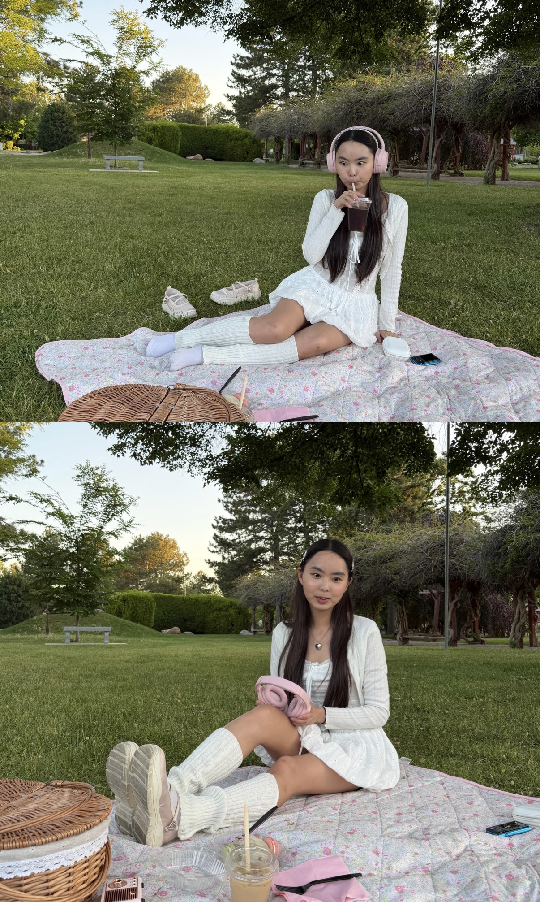

<table>
<tr>
<td width="320" valign="middle">

<a href="cv.pdf" target="_blank">
  Curriculum Vitae (CV)
</a>

</td>

<td valign="top">

<h1>Stella (Eunsoo) Hong</h1>

<i>Hi!! You have rightfully stumbled upon my personal page :))</i>

My name is Stella, and I am currently a second year PhD student in Linguistics at the University of Utah.

Although I am still in the process of developing my academic taste, I am broadly interested in interdisciplinary work that crosses the boundary between connectionist and symbolic perspectives.

My academic background has taken a somewhat unconventional trajectory. I initially began in a more humanistically grounded field through American Culture Studies, which cultivated my interest in critical thinking and analytical reasoning at the societal and cultural level. Over time, however, my longstanding fascination with sound and quantitatively grounded research led me toward speech signal processing and AI-based speech technologies, particularly questions surrounding ASR interpretability and phonetically informed representation learning.

As I continued working in speech technology, I gradually found myself increasingly drawn not only to technological development itself, but also to the more principled and theoretical questions underlying language structure and cognition. While I remain deeply interested in computational and connectionist approaches, my broader goal is ultimately linguistic in nature: understanding how structured and gradient aspects of human language emerge from domain-general learning mechanisms rather than language-specific biases

With that being said, my work broadly spans theoretical linguistics, cognitively informed empirical research, signal processing, and computational modeling.

 

</td>
</tr>
</table>

Some themes I am especially drawn to include:

<ol>

<li>
Formal language theory in neural networks  
related works:
<a href="PLT_LTT.pdf" target="_blank">
Investigating interactions between neural network architectural bias and formal language structure
</a>,
<a href="CrossModal_SSL.pdf" target="_blank">
Probing phonological representations in cross-modal self-supervised speech models
</a>
</li>

 

<li>
Statistical learning informed by formal structure  
related works:
<a href="scil_submission.pdf" target="_blank">
SCiL 2026 accepted paper
</a>
(for a shortened version, see
<a href="AMP_shortened.pdf" target="_blank">
the AMP abstract recently submitted for review
</a>),
<a href="BiPhon.pdf" target="_blank">
Revising the BiPhon model to accommodate non-equidistant sound change in Korean back vowel chain shifts
</a>
</li>

 

<li>
Relationship between phonetic gradients and phonological categories  
related works:
<a href="APSIPA.pdf" target="_blank">
APSIPA 2024 accepted paper
</a>,
<a href="APSIPA_extended.pdf" target="_blank">
Extended writing sample version
</a>,
<a href="CPP.pdf" target="_blank">
LabPhon project paper on using CPP to categorize voiced fricatives
</a>
</li>

 

<li>
Representational granularity at linguistic interfaces  
related works:
<a href="Predication.pdf" target="_blank">
Cross-theoretical comparison of semantic transparency in syntactic accounts of predication
</a>,
<a href="RC_nominal.pdf" target="_blank">
Accounting for Korean relative clauses in the nominal domain
</a>,
<a href="Mparse.pdf" target="_blank">
Revisiting gradient correspondence relations in output-to-output phonological parsing
</a>
</li>

</ol>

Feel free to explore some of my past and ongoing projects, along with the research directions I am currently interested in pursuing!!

